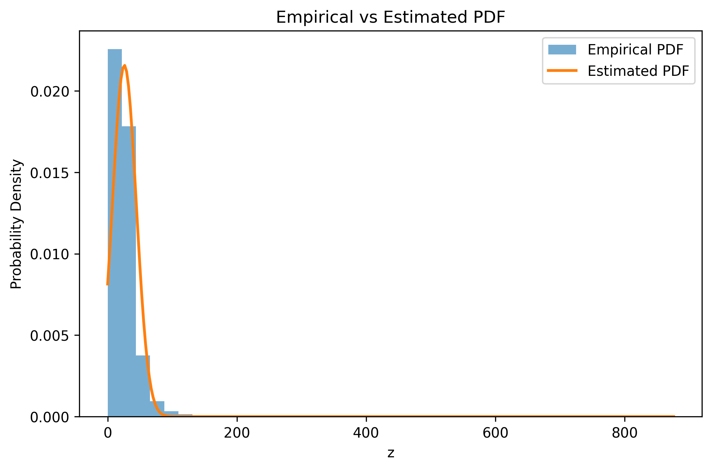

# Probability Density Functions Assignment – UCS654

This repository contains the solution for Assignment-1 of UCS654.
The objective of this assignment is to learn the parameters of a
probability density function using a roll-number-parameterized
non-linear transformation.

---

## Dataset
**India Air Quality Dataset**
- Feature used: **NO₂ concentration**
- Dataset file: `data.csv`

---

## Transformation
Each NO₂ value (x) is transformed into z using a non-linear function:
z = x + a_r sin(b_r x)
where:
- (a_r = 0.05 x (r mod 7))
- (b_r = 0.3 x (r mod 5 + 1)
- r is the university roll number
For this submission:
- (a_r = 0.25)
- (b_r = 1.5)

---

## Probability Density Function
The transformed variable (z) is modeled using the following probability
density function:

p̂(z) = c · exp(−λ (z − μ)²)

---

## Parameter Estimation
The parameters μ, λ, and c are estimated using
sample statistics (Method of Moments) on the transformed data.

---

## Output Values

## Estimated PDF Plot

The following plot shows the empirical probability density function
along with the estimated PDF.

## Tools Used

- Python  
- NumPy  
- Pandas  
- Matplotlib

